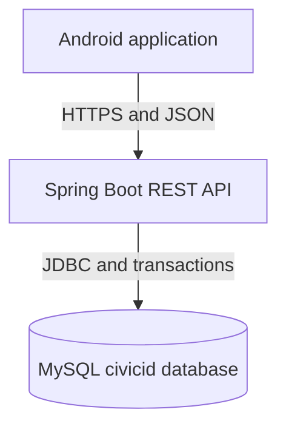
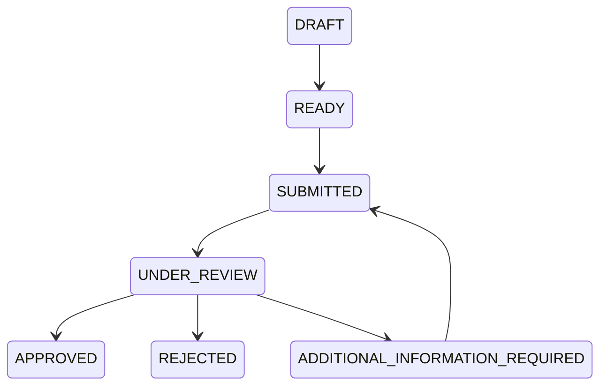

# CivicID Backend Architecture

## System boundary

The Android app contains presentation and client-side interaction logic. The backend authenticates users, validates requests, applies business rules and controls database access. MySQL provides persistent relational storage.

## Main modules

| Module | Responsibility |
|---|---|
| `auth` | Registration, login and current-user responses |
| `security` | BCrypt password hashing, JWT creation and access rules |
| `user` | Citizen accounts and profile information |
| `catalog` | Government services, dynamic fields and requirements |
| `document` | Upload metadata, file storage and downloads |
| `application` | Drafts, form values, attachments, readiness and submission |
| `admin` | Review queue, document verification and decisions |
| `notification` | Citizen alerts and unread counts |
| `audit` | Administrative and security-relevant activity records |
| `health` | Backend-to-MySQL connectivity verification |

## Roles

### Citizen

- Registers and signs in
- Completes a Citizen profile
- Uploads personal documents
- Views available services
- Creates and completes applications
- Tracks statuses and reads messages

### Administrator

- Views dashboard totals and submitted applications
- Starts application reviews
- Verifies or rejects supporting documents
- Requests more information
- Approves or rejects applications
- Views audit logs

## Application lifecycle

Every transition is recorded in `application_status_history` with its actor, time and notes.

## Security model

- Passwords are stored as BCrypt hashes.
- Successful login issues a signed HS256 JWT.
- The JWT contains the user ID, email and role.
- Citizen and Administrator routes are authorised separately.
- The backend uses the restricted `civicid_app` MySQL account.
- Uploaded file paths are normalised to prevent path traversal.
- The existing schema is treated as the source of truth.

## Data ownership

Citizen resources are always filtered using the authenticated JWT user ID. Administrator endpoints require the `ADMIN` role. The Android client cannot choose another Citizen's database owner ID.
